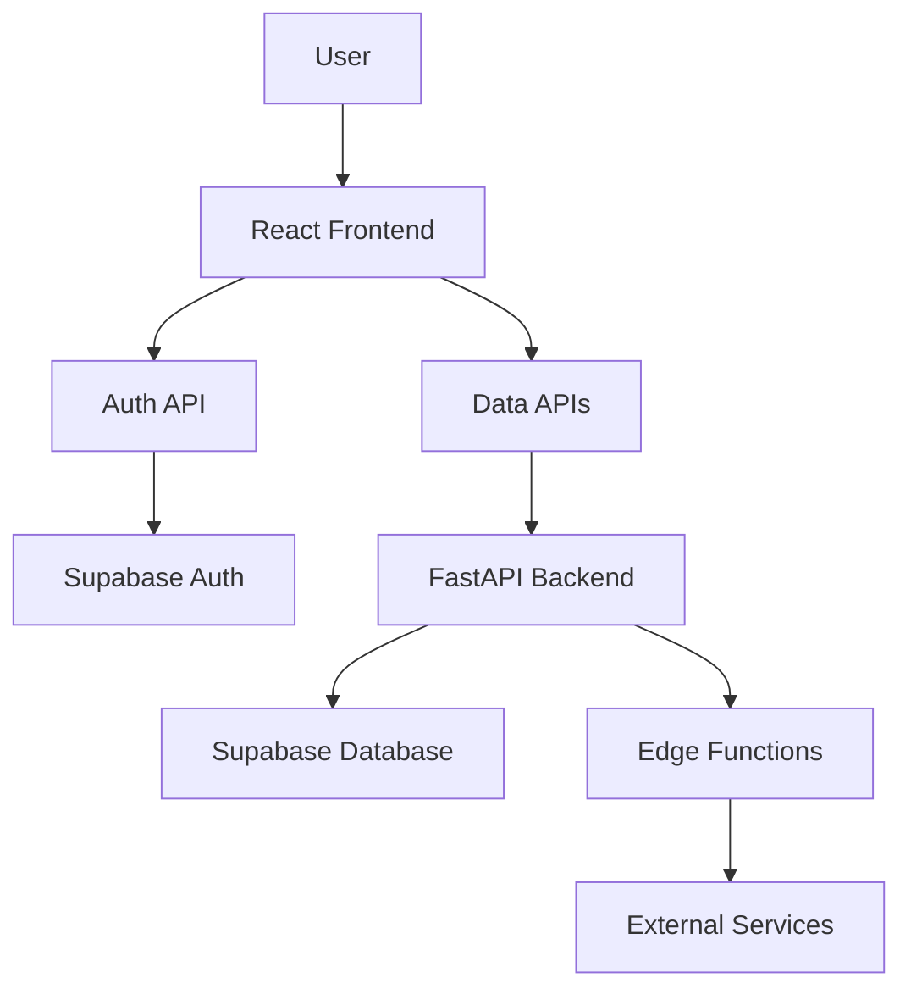

# Property Management System Documentation

## System Overview

This property management system is a comprehensive solution designed to help property owners manage their properties, tenants, maintenance requests, payments, and documents. The system follows a modern full-stack architecture with clear separation of concerns.

## Architecture

### Tech Stack

- **Frontend**: React/TypeScript with Vite
- **Backend**: Python FastAPI
- **Database**: PostgreSQL via Supabase
- **Authentication**: Supabase Auth
- **Storage**: Supabase Storage
- **Serverless Functions**: Supabase Edge Functions

### System Components



## Database Schema

The database is well-structured with clear relationships between entities:

### Core Tables

1. **properties**: Stores property information including address, amenities, and physical characteristics
   - Linked to owner via `owner_id` (references `user_profiles`)
   - Has many units, documents, and tenants through relationship tables
   - Contains fields for property details, location, amenities, and images

2. **units**: Represents individual rental units within properties
   - Linked to property via `property_id`
   - Tracks status (Vacant, Occupied, Under Maintenance)
   - Stores details like bedrooms, bathrooms, rent amount

3. **tenants**: Stores tenant information
   - Linked to properties through `property_tenants` junction table
   - Contains personal details, rental terms, and responsibilities
   - Has a status enum: "active", "unassigned", "inactive"

4. **user_profiles**: Stores user information
   - Linked to Supabase auth.users
   - Contains contact information and user type

### Supporting Tables

5. **payments**: Tracks rent and other payments
   - Links to property, tenant, and unit
   - Tracks payment status, due dates, and receipts

6. **maintenance_requests**: Tracks maintenance issues
   - Links to property, tenant, and unit
   - Includes priority, category, and status tracking

7. **documents**: Stores document metadata
   - Can be linked to properties, tenants, maintenance requests
   - Tracks document type, version, and access level

8. **agreements**: Stores lease agreements
   - Links property owner, tenant, and property
   - Tracks agreement terms, status, and signatures

### Junction Tables

9. **property_tenants**: Links tenants to properties
   - Tracks tenancy period with start/end dates
   - Includes unit number for reference

### Entity Relationship Diagram (Simplified)

```
properties 1--* units
properties 1--* property_documents
properties 1--* property_tenants
properties 1--* tax_payments
properties 1--* maintenance_requests
properties 1--* documents
properties *--1 user_profiles (owner)

tenants 1--* property_tenants
tenants 1--* maintenance_requests
tenants 1--* payment_history
tenants 1--* payment_tracking
tenants 1--* documents
tenants 1--* agreements

units 1--* maintenance_requests
units 1--* payments
units 1--* amenities
units 1--* taxes

maintenance_requests 1--* maintenance_messages
maintenance_requests 1--* maintenance_comments
maintenance_requests *--1 maintenance_vendors
```

## Backend API

The backend API is built with FastAPI and organized into logical modules:

### API Structure

- **/properties**: CRUD operations for properties and related units
- **/units**: Management of units within properties
- **/tenants**: Tenant management, invitations, and lease tracking
- **/maintenance**: Maintenance request tracking and vendor management
- **/payments**: Payment processing and tracking
- **/documents**: Document management and storage
- **/auth**: Authentication and user management

### Units API Endpoints

The Units API provides comprehensive endpoints for managing property units:

1. **GET /units**
   - Lists all units with optional filtering by property_id and status
   - Supports pagination with skip and limit parameters
   - Returns array of unit objects with details

2. **GET /units/{unit_id}**
   - Retrieves detailed information about a specific unit
   - Includes current tenant information if available

3. **POST /units**
   - Creates a new unit for a property
   - Requires property_id, unit_number, and other unit details
   - Validates that unit number is unique within the property

4. **PUT /units/{unit_id}**
   - Updates details for a specific unit
   - Supports partial updates (only fields that need to be changed)

5. **DELETE /units/{unit_id}**
   - Deletes a specific unit
   - Returns 204 No Content on success

6. **GET /units/{unit_id}/maintenance_requests**
   - Lists maintenance requests associated with a specific unit

7. **POST /units/{unit_id}/maintenance_requests**
   - Creates a new maintenance request for a unit
   - Requires title, description, priority, and category

8. **GET /units/{unit_id}/tenants**
   - Lists tenants associated with a specific unit

9. **POST /units/{unit_id}/tenants**
   - Assigns a tenant to a unit
   - Creates lease/rental agreement

10. **GET /units/{unit_id}/payments**
    - Lists payments associated with a specific unit

11. **GET /units/{unit_id}/amenities**
    - Lists amenities associated with a specific unit

12. **POST /units/{unit_id}/amenities**
    - Adds a new amenity to a unit

13. **GET /units/{unit_id}/taxes**
    - Lists tax records associated with a specific unit

14. **POST /units/{unit_id}/taxes**
    - Adds a new tax record to a unit

15. **GET /units/{unit_id}/history**
    - Retrieves comprehensive history of a unit including tenants, leases, payments, and maintenance requests

### Authentication & Authorization

The API uses JWT-based authentication via Supabase Auth:

- All endpoints require a valid JWT token in the Authorization header
- Row Level Security (RLS) in Supabase ensures data access control
- API endpoints validate user permissions before performing operations

## Frontend Architecture

The frontend is built with React and TypeScript, following a component-based architecture:

### Directory Structure

- **/src/components**: Reusable UI components organized by feature
- **/src/contexts**: React contexts for state management
- **/src/hooks**: Custom hooks for API interactions and business logic
- **/src/pages**: Page components for different routes
- **/src/api**: API client and service functions
- **/src/utils**: Utility functions
- **/src/types**: TypeScript type definitions
- **/src/lib**: Third-party library integrations

### Key Components

- **Layout.tsx**: Main layout component with navigation
- **Sidebar.tsx**: Navigation sidebar
- **Property components**: Components for property management
- **Tenant components**: Components for tenant management
- **Maintenance components**: Components for maintenance requests
- **Payment components**: Components for payment processing
- **Document components**: Components for document management

### State Management

The application uses React Context API for state management:

- **AuthContext**: Manages authentication state and user information
- **PropertyDialogContext**: Manages property dialog state

### Custom Hooks

The application uses custom hooks for API interactions:

- **useAuthApi**: Authentication API interactions
- **usePropertiesApi**: Property API interactions
- **useTenantsApi**: Tenant API interactions
- **useMaintenanceApi**: Maintenance API interactions
- **usePaymentsApi**: Payment API interactions
- **useFileUpload**: File upload functionality
- **useDataCache**: Data caching functionality

## Supabase Integration

The system leverages Supabase for several key features:

### Supabase Auth

- JWT-based authentication
- User management
- Role-based access control

### Supabase Database

- PostgreSQL database with Row Level Security
- Real-time subscriptions for live updates
- Complex queries and relationships

### Supabase Storage

- File storage for property images, documents, etc.
- Secure access control with signed URLs
- Bucket organization for different file types

### Supabase Edge Functions

The system uses several Edge Functions for specific features:

1. **send-tenant-invitation**: Sends email invitations to tenants using Resend API
2. **verify-invitation**: Verifies tenant invitation tokens
3. **generate-agreement**: Generates rental agreements using Claude AI
4. **notify-tenant**: Sends notifications to tenants for bills and vacate notices
5. **createPropertyWithImages**: Handles property creation with image uploads
6. **manage-schema**: Manages database schema updates

## Security Model

The application implements several security measures:

1. **JWT Authentication**: Secure token-based authentication
2. **Row Level Security**: Database-level access control
3. **API Authorization**: Endpoint-level permission checks
4. **CORS Protection**: Cross-origin request security
5. **Input Validation**: Pydantic models for request validation

## Key Workflows

### Property Management
1. Owner creates property with details and images
2. Owner can add units to the property
3. Owner can manage property details, documents, and maintenance

### Tenant Management
1. Owner creates tenant profile
2. System sends invitation to tenant
3. Tenant accepts invitation and creates account
4. Tenant is linked to property/unit

### Maintenance Management
1. Tenant or owner creates maintenance request
2. Owner assigns vendor or handles request
3. Status updates and comments track progress
4. Request is marked complete when resolved

### Payment Processing
1. System generates payment records based on lease terms
2. Notifications sent for upcoming/overdue payments
3. Payments tracked with receipts and status updates

## Testing

The system includes comprehensive testing:

1. **API Testing**: Tests for all API endpoints
2. **Unit Testing**: Tests for individual components and functions
3. **Integration Testing**: Tests for interactions between components
4. **End-to-End Testing**: Tests for complete user workflows

## Deployment

The system can be deployed using:

1. **Docker**: Containerized deployment with Docker Compose
2. **Netlify**: Frontend deployment
3. **Supabase**: Database, Auth, and Storage
4. **Vercel/Netlify**: Backend API deployment

## Conclusion

This property management system provides a comprehensive solution for property owners to manage their properties, tenants, maintenance requests, payments, and documents. The system is built with modern technologies and follows best practices for security, scalability, and maintainability.
